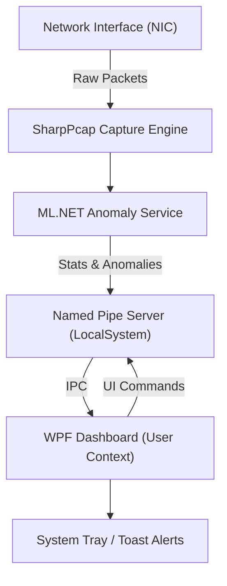

# ML.NET Network Anomaly Detection

A professional, real-time network traffic monitoring and anomaly detection system powered by **ML.NET** and **WPF**. This application uses a Service-Client architecture to provide high-performance packet analysis with a rich, interactive dashboard.

## 🚀 Features

- **Real-Time Analysis**: Monitors network traffic with millisecond latency using `SharpPcap`.
- **AI-Powered Detection**: Leverages ML.NET Anomaly Detection to identify unusual traffic patterns, port scans, and data spikes.
- **Service-Client Architecture**: 
  - **Background Service**: A high-privilege Windows Service that performs the heavy lifting of packet capture and AI inference.
  - **System Tray UI**: A low-privilege user application providing instant alerts and access to the dashboard.
- **Interactive Dashboard**:
  - Live charts showing traffic volume vs. anomaly scores.
  - Detailed metrics: Packets/sec, Unique IPs, Unusual Port traffic, and Outbound Ratio.
  - Manual adapter selection with high-contrast UI.
- **Persistence**: Remembers your preferred network adapter across machine restarts.

## 🏗️ Architecture



## 🛠️ Getting Started

### Prerequisites
- **.NET 10 SDK** or later.
- **NPcap** (Install with WinPcap compatibility mode).
- **WiX Toolset v4** (For building the installer).

### Installation
1. Download the latest `MLNetAnomalyDetection.msi` from the [Releases](https://github.com/ian-cowley/MLNetAnomalyDetection/releases) page.
2. Run the installer to register the background service and tray application.
3. Launch the application from the Start Menu or via the tray icon.

### Development
```powershell
# Clone the repository
git clone https://github.com/ian-cowley/MLNetAnomalyDetection.git

# Navigate to source
cd src

# Restore and build
dotnet build
```

## 📊 Anomaly Metrics
The system evaluates traffic based on:
- **Packet Velocity**: Sudden spikes in packet frequency.
- **IP Diversity**: Unusual number of unique IP connections.
- **Port Profiling**: Traffic targeting rare or non-standard ports.
- **Asymmetry**: High outbound-to-inbound traffic ratios.

## 📄 License
This project is licensed under the MIT License - see the [LICENSE](LICENSE) file for details.
